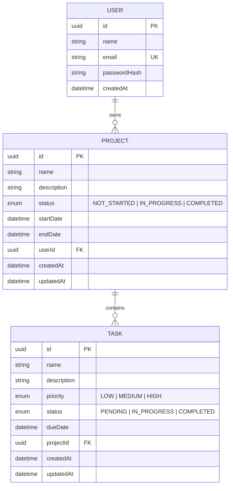

# ER diagram

```mermaid
erDiagram
  USER ||--o{ PROJECT : owns
  PROJECT ||--o{ TASK : contains
  USER {
    uuid id PK
    string name
    string email UK
    string passwordHash
    datetime createdAt
  }
  PROJECT {
    uuid id PK
    string name
    string description
    enum status "NOT_STARTED | IN_PROGRESS | COMPLETED"
    datetime startDate
    datetime endDate
    uuid userId FK
    datetime createdAt
    datetime updatedAt
  }
  TASK {
    uuid id PK
    string name
    string description
    enum priority "LOW | MEDIUM | HIGH"
    enum status "PENDING | IN_PROGRESS | COMPLETED"
    datetime dueDate
    uuid projectId FK
    datetime createdAt
    datetime updatedAt
  }
```
Deleting a user deletes their projects; deleting a project deletes its tasks (`onDelete: Cascade`). Indexes on `Project.userId` and `Task.projectId`.
